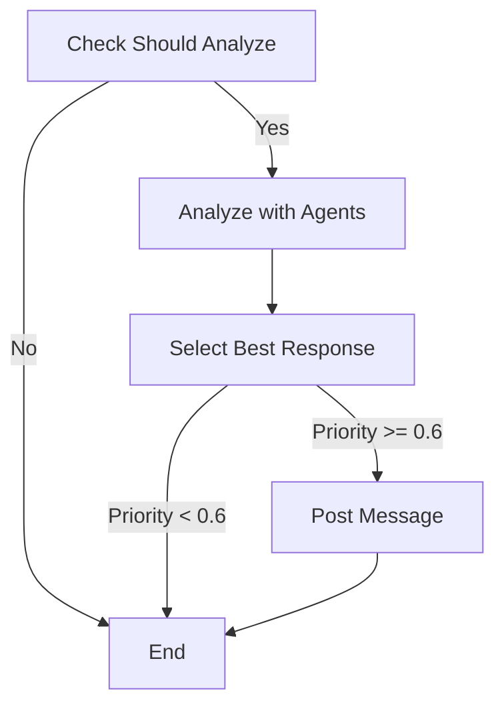

# AI Meeting Agent System - Step 3完了版

**LangGraphワークフロー + 議事録自動生成 + データベース統合**

会議に参加して各専門家の視点で発言するAIエージェントシステムの完全版です。

---

## 🎉 Step 3で追加された機能

### 1. **LangGraphワークフロー**
- 条件分岐による動的な分析フロー
- ステートフルな会議管理
- グラフベースのワークフロー構築

### 2. **議事録自動生成**
- 会議終了後の自動議事録作成
- アクションアイテムの抽出
- 決定事項のハイライト

### 3. **データベース統合（SQLite）**
- 会議履歴の永続化
- 文字起こしの保存
- エージェント発言の記録
- 統計情報の管理

---

## 📦 システム構成

```
会議（Google Meet/Teams）
    ↓ Bot参加
Recall.ai Bot Service
    ↓ Webhook（リアルタイム文字起こし）
Webhook Server (FastAPI)
    ↓
LangGraph Workflow
    ├→ Check Should Analyze（条件判定）
    ├→ Analyze with Agents（並列分析）
    │   ├→ PM Agent
    │   ├→ Marketer Agent
    │   ├→ Legal Agent
    │   ├→ Sales Agent
    │   └→ Consultant Agent
    ├→ Select Best Response（最適発言選択）
    ├→ Post Message（チャット投稿）
    └→ Generate Summary（議事録生成）
    ↓
SQLite Database（永続化）
```

---

## 🚀 クイックスタート

### 1. 環境設定

```bash
# リポジトリをクローン
git clone https://github.com/YukiKunii0920/AITEST.git
cd AITEST

# 仮想環境を作成
python3 -m venv venv
source venv/bin/activate

# 依存パッケージをインストール
pip install -r requirements.txt

# 環境変数を設定
# config/.env を編集して以下を設定:
# - RECALL_API_KEY
# - OPENAI_API_KEY
# - WEBHOOK_PUBLIC_URL
```

### 2. Webhookサーバーを起動

```bash
python src/main_with_langgraph.py
```

### 3. ngrokでWebhookを公開（別ターミナル）

```bash
ngrok http 8000
# 表示されたURLをconfig/.envのWEBHOOK_PUBLIC_URLに設定
```

### 4. ボットを会議に参加させる

```bash
python src/create_bot_with_langgraph.py "https://meet.google.com/xxx-yyyy-zzz"
```

### 5. 会議で話す

会議で議論すると、AIエージェントが自動的に分析してアドバイスを投稿します。

### 6. 統計情報を確認

```bash
curl http://localhost:8000/statistics
```

### 7. 議事録を生成

```bash
curl -X POST http://localhost:8000/generate_summary/<bot_id>
```

### 8. 会議履歴を閲覧

```bash
# 会議リストを表示
python src/view_meetings.py

# 特定の会議の詳細を表示
python src/view_meetings.py --bot-id <bot_id>
```

---

## 📊 LangGraphワークフロー

### ワークフローの流れ



### 条件分岐

1. **分析実行判定**
   - 文字起こし数が5件以上
   - 前回の分析から10件以上増加
   - 前回の分析から30秒以上経過

2. **発言投稿判定**
   - 優先度スコアが0.6以上
   - 最後の投稿から30秒以上経過
   - エージェントごとの発言回数が上限以下

### 状態管理

LangGraphの`TypedDict`を使用してステートフルな会議管理を実現：

- 文字起こし履歴
- 参加者情報
- エージェント分析結果
- 議事録データ
- 統計情報

---

## 🤖 マルチエージェントシステム

### 5つの専門家AIエージェント

| エージェント | 役割 | 分析視点 |
|------------|------|---------|
| 📊 PM Agent | プロジェクト管理 | スケジュール、リソース、リスク |
| 📈 Marketer Agent | 市場・顧客 | 顧客ニーズ、競合優位性、ブランディング |
| ⚖️ Legal Agent | 法務・コンプライアンス | 契約リスク、知的財産権、法規制 |
| 💼 Sales Agent | 売上・顧客関係 | 売上機会、顧客満足度、チャーンリスク |
| 💡 Consultant Agent | 論理構成・課題解決 | 論理的整合性、MECE、フレームワーク |

### 発言制御

- **優先度スコア**: 自信度、緊急度、関連性から計算
- **発言間隔**: 最小30秒
- **発言回数制限**: エージェントごとに最大5回
- **重複排除**: 類似した内容の繰り返しを防止

---

## 📝 議事録自動生成

### 生成される情報

1. **会議の要約**: 主要なトピックと議論内容（200-300文字）
2. **決定事項**: 会議で決定されたこと
3. **アクションアイテム**: 誰が何をいつまでにするか

### 使い方

```bash
# 会議終了後、議事録を生成
curl -X POST http://localhost:8000/generate_summary/<bot_id>

# または、Pythonスクリプトから
python -c "
import requests
response = requests.post('http://localhost:8000/generate_summary/<bot_id>')
print(response.json())
"
```

### 出力例

```json
{
  "bot_id": "xxx-yyy-zzz",
  "meeting_url": "https://meet.google.com/xxx-yyyy-zzz",
  "meeting_title": "プロジェクト進捗会議",
  "start_time": "2024-01-01T10:00:00",
  "end_time": "2024-01-01T11:00:00",
  "summary": "新機能の開発について議論しました。スケジュールが未確定であることが課題として挙げられ、次回までに担当者とデッドラインを確定することが決定されました。",
  "decisions": [
    {
      "content": "次回ミーティングまでに担当者とデッドラインを確定する",
      "timestamp": "2024-01-01T10:15:00"
    }
  ],
  "action_items": [
    {
      "task": "担当者とデッドラインを確定",
      "assignee": "Alice",
      "due_date": "2024-01-08",
      "timestamp": "2024-01-01T10:15:00"
    }
  ],
  "transcript_count": 25,
  "participant_count": 3,
  "analysis_count": 2,
  "message_count": 1,
  "errors": []
}
```

---

## 💾 データベース

### スキーマ

#### meetings テーブル
- `id`: 会議ID（主キー）
- `bot_id`: ボットID（ユニーク）
- `meeting_url`: 会議URL
- `meeting_title`: 会議タイトル
- `start_time`: 開始時刻
- `end_time`: 終了時刻
- `summary`: 要約
- `transcript_count`: 文字起こし数
- `participant_count`: 参加者数
- `analysis_count`: 分析回数
- `message_count`: メッセージ数
- `error_count`: エラー数

#### transcripts テーブル
- `id`: ID（主キー）
- `meeting_id`: 会議ID（外部キー）
- `speaker`: 話者
- `text`: テキスト
- `timestamp`: タイムスタンプ
- `is_partial`: 部分的かどうか

#### decisions テーブル
- `id`: ID（主キー）
- `meeting_id`: 会議ID（外部キー）
- `content`: 内容
- `timestamp`: タイムスタンプ

#### action_items テーブル
- `id`: ID（主キー）
- `meeting_id`: 会議ID（外部キー）
- `task`: タスク
- `assignee`: 担当者
- `due_date`: 期限
- `timestamp`: タイムスタンプ
- `status`: ステータス

#### agent_messages テーブル
- `id`: ID（主キー）
- `meeting_id`: 会議ID（外部キー）
- `agent_name`: エージェント名
- `content`: 内容
- `confidence`: 自信度
- `urgency`: 緊急度
- `relevance`: 関連性
- `priority_score`: 優先度スコア

### 会議履歴の閲覧

```bash
# 会議リストを表示
python src/view_meetings.py

# 特定の会議の詳細を表示
python src/view_meetings.py --bot-id <bot_id>
```

---

## 🧪 テスト

### ワークフローのテスト

```bash
python src/test_workflow.py
```

このスクリプトは以下をテストします：

1. LangGraphワークフローの実行
2. エージェント分析
3. 発言選択
4. 議事録生成

---

## 📚 ドキュメント

- [クイックスタートガイド](QUICKSTART.md) - 10分で起動
- [セットアップガイド](docs/SETUP_GUIDE.md) - 詳細なセットアップ手順
- [アーキテクチャ](docs/ARCHITECTURE.md) - システム設計
- [Step 1完了レポート](docs/STEP1_COMPLETION.md) - Recall.ai統合
- [Step 2完了レポート](docs/STEP2_COMPLETION.md) - マルチエージェント
- [Step 3完了レポート](docs/STEP3_COMPLETION.md) - LangGraph + DB統合

---

## 🔧 技術スタック

| カテゴリ | 技術 |
|---------|------|
| Bot Service | Recall.ai |
| LLM | OpenAI GPT-4o-mini |
| Workflow | LangGraph |
| Web Framework | FastAPI |
| Database | SQLite |
| Language | Python 3.10+ |

---

## 💰 コスト試算

### 月100時間会議の場合

| 項目 | 月額コスト |
|-----|-----------|
| Recall.ai Bot | $70.00 |
| OpenAI API (GPT-4o-mini) | $0.86 |
| インフラ（AWS等） | $20-50 |
| **合計** | **$91-121** |

---

## 🎛️ カスタマイズ

### 分析条件の調整

`src/workflow/nodes.py` の `check_should_analyze` 関数を編集：

```python
# 最小文字起こし数
min_transcript_count = 5  # デフォルト: 5

# 分析間隔（文字起こし数）
analysis_interval = 10  # デフォルト: 10

# 最小時間間隔（秒）
min_time_interval = 30  # デフォルト: 30
```

### 発言閾値の調整

`src/workflow/nodes.py` の `select_best_response` 関数を編集：

```python
# 優先度閾値
priority_threshold = 0.6  # デフォルト: 0.6
```

---

## 📂 プロジェクト構造

```
AITEST/
├── config/
│   ├── .env                    # 環境設定
│   ├── .env.example            # 環境設定テンプレート
│   └── current_bot_id.txt      # 現在のボットID
├── data/
│   └── meetings.db             # SQLiteデータベース
├── docs/
│   ├── ARCHITECTURE.md         # アーキテクチャ
│   ├── SETUP_GUIDE.md          # セットアップガイド
│   ├── STEP1_COMPLETION.md     # Step 1完了レポート
│   ├── STEP2_COMPLETION.md     # Step 2完了レポート
│   └── STEP3_COMPLETION.md     # Step 3完了レポート
├── src/
│   ├── agents/                 # エージェントモジュール
│   │   ├── base_agent.py
│   │   ├── pm_agent.py
│   │   ├── marketer_agent.py
│   │   ├── legal_agent.py
│   │   ├── sales_agent.py
│   │   ├── consultant_agent.py
│   │   ├── supervisor.py
│   │   └── meeting_analyzer.py
│   ├── bot/                    # Botモジュール
│   │   ├── recall_client.py
│   │   └── webhook_server.py
│   ├── database/               # データベースモジュール
│   │   └── models.py
│   ├── workflow/               # LangGraphワークフロー
│   │   ├── state.py
│   │   ├── nodes.py
│   │   ├── graph.py
│   │   └── meeting_analyzer_v2.py
│   ├── utils/                  # ユーティリティ
│   │   ├── config.py
│   │   └── logger.py
│   ├── main_with_langgraph.py  # メインアプリ（LangGraph版）
│   ├── create_bot_with_langgraph.py  # ボット作成（LangGraph版）
│   ├── test_workflow.py        # ワークフローテスト
│   └── view_meetings.py        # 会議履歴閲覧
├── QUICKSTART.md               # クイックスタート
├── README_STEP3.md             # このファイル
└── requirements.txt            # 依存パッケージ
```

---

## 🚧 今後の拡張予定

### 実装予定の機能

1. **Deepgram統合**: 高精度な日本語STT
2. **RAG（検索拡張生成）**: 過去の会議履歴や社内ドキュメントを参照
3. **Human-in-the-loop**: 人間の承認機能
4. **PostgreSQL統合**: スケーラブルなデータベース
5. **Web UI**: 会議履歴の可視化
6. **Slack/Teams統合**: 議事録の自動通知

---

## 🐛 トラブルシューティング

### Botが会議に参加しない

**原因**: 会議URLが間違っている、またはRecall.ai APIキーが無効

**解決策**:
1. 会議URLを確認
2. `config/.env` の `RECALL_API_KEY` を確認
3. ボットの状態を確認: `python src/get_bot_status.py <bot_id>`

### エージェントが発言しない

**原因**: OpenAI APIキーが設定されていない、または優先度が低い

**解決策**:
1. `config/.env` の `OPENAI_API_KEY` を確認
2. ログを確認: `logs/bot.log`
3. 優先度閾値を下げる（上記「カスタマイズ」参照）

### Webhookが受信できない

**原因**: ngrokのURLが間違っている、またはngrokが停止している

**解決策**:
1. ngrokが起動しているか確認
2. `config/.env` の `WEBHOOK_PUBLIC_URL` を確認
3. Webhookサーバーを再起動

### データベースエラー

**原因**: データベースファイルが破損している

**解決策**:
1. `data/meetings.db` を削除して再起動
2. ログを確認: `logs/bot.log`

---

## 📞 サポート

- GitHub Issues: https://github.com/YukiKunii0920/AITEST/issues
- Recall.ai ドキュメント: https://docs.recall.ai
- LangGraph ドキュメント: https://langchain-ai.github.io/langgraph/

---

**実装者**: Manus AI Agent  
**日付**: 2025年12月27日  
**バージョン**: Step 3完了版
